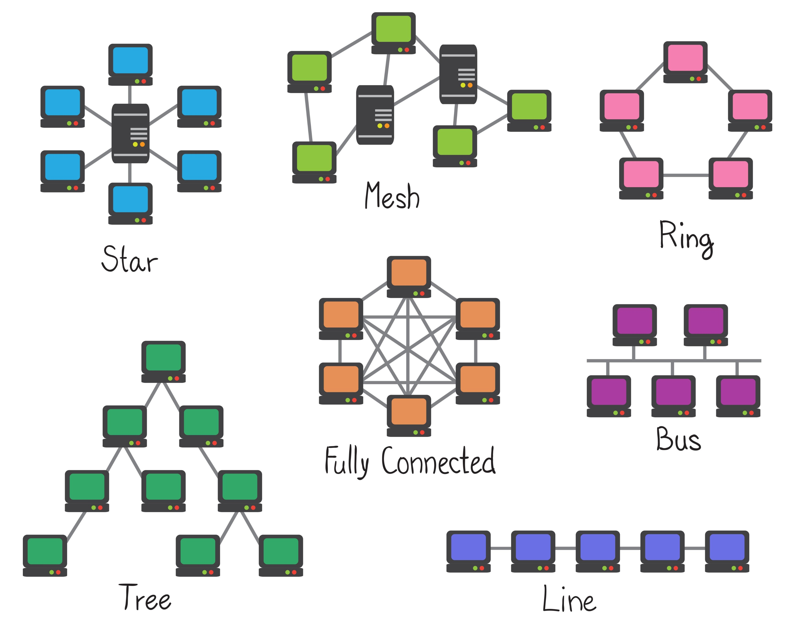
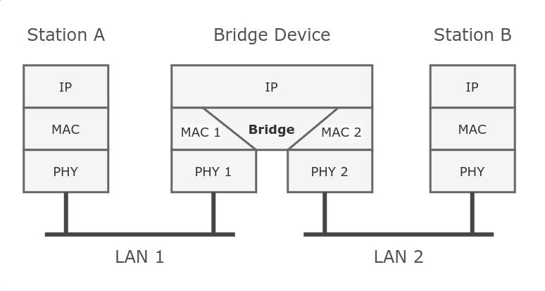

# Síťové  Topologie (Struktura sítě)
- Topologie určuje, jak jsou zařízení v síti vzájemně propojena. Dělíme ji na fyzickou (jak vedou kabely) a logickou (jak tečou data)

## Typy topologií:

### Bus
- **Jak to vypadá:** Jeden hlavní kabel (páteř), kde kterému jsou připojeny všechny počítače.
- **Vlastnosti:** Dříve velmi efektivní a levná.
- **Nevýhody:** Pokud se hlavní kabel kdekoliv přeruší, celá síť přestane fungovat. Dnes se už v LAN sítích téměř nepoužívá  (zastaralé koaxiální kabely). 
### Line
- **Jak to vypadá:** Počítače jsou zapojeny za sebou.
- **Specifikum:** Každý počítač musí mít **dvě síťové karty** (jednou příjme, druhou pošle dál).
- **Nevýhody:** Přerušení jednoho článku přeruší spojení pro všechny za ním. 

### Ring
- **Jak to vypadá:** Počítače jsou propojeny do uzavřeného kruhu.  
- **Výhoda:** Signál cestuje jedním směrem a zesiluje se na každé stanici. Existují varianty (např. FDDI), kde 

- struktura sítě (star, mesh, bus, ring, tree, line, fully Connected)
	- ring výhoda že když přestane fungovat jedna cesta stále funguje
	- line/bus byl jeden z nejefektivnější ale když se přerušila cesta tak přestalo fungovat (v linu musí mít každý pc 2 karty)
	- mesh samostatné připojení neuspořádané rozpoložení (WIFI) obvykle město výhoda mohu přerušit polovinu a bude stálo fungovat, nevýhody drahá nepraktická 
	- hvězda nejlevnější n počítaču na jeden switch když se přruší jeden spojen spadne jeden pc ale když spadne switch tak všichni
	- tree každý prvek má minimálně 2 připojení taková namakaná star topologie
	- Otázka kdy při jaké příležitosti použijete jakou topologie
## síťové prvky
- zařízení: 
	- ### Router(L3)
		L3
		L4 TCP / UDP
			DST destitation
			SRC source
			IPA ip adresa
			TTL time to live (pouze u IPV4, u IPV6 je stejná technologie ale má to jiný název)
			CRC kontrolní součet 
			FLAGS umožnuje nám pracovat s připojením
			Heady označení IPV (IPV4, IPV6)
			Jak je dlouhý obsah 
			MAX size = 65 535 MTU
			obrázek paketu máš ho v telefonu 5.12.2025
		router překládá data mezi sítěmi komunikace mezi sítěmi
		MAC adresa vždy mění nejbližším skokem

	- ### Switch(!!!(L2) nový moderní i L3)(propojení vzájemné v síti), představ jsi že každý port je jakoby ostrov a potřebuji tam dostat brigde 
		uplink porty
		Cam tabulka
		Vlany jsou L2 je jich (4 096)
	- Hub(L1) rozšiřuje pouze elektrický pulzy a duplikuje a odevzdají zbytku síti 
	- koncové stanice (tyhle zařízení pracují na všechny 7 vrstvách ) (pc, server),
	- Apečko(L1/L2),
	- Firewall (převážně ty první dvě L3/L4/L5) (fyzický firewall (Fortinet))
- Aktivní prvky potřebují napájení 

### Firewall
- není nezbytný aby fungoval wifi
- L3 (Paketový / síťový)
- L7 Aplikační (Windows defender, TinyWall)
- L4 Stavový (TCP UDP => {**Porty**} )
| Tabulky | Mangle | RAW | NAT | Filter |
|---------|--------|-----|-----|--------|
|    /    |    /    |   /  |  SRC-NAT   | Input a Output|
|   /     |    /    |  /   | DST-NAT    | Forward |

## ip adresy
## zabezpečení 
## rychlosti k
## technologie kabelu 
- (optika, cat 6, cat 5) typ kabeláže